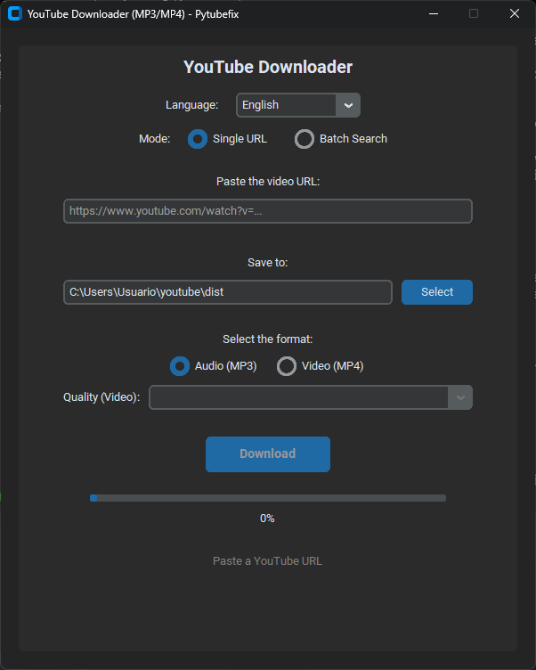
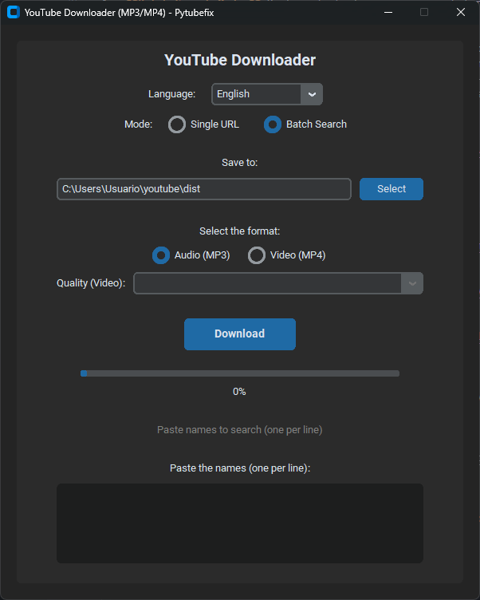
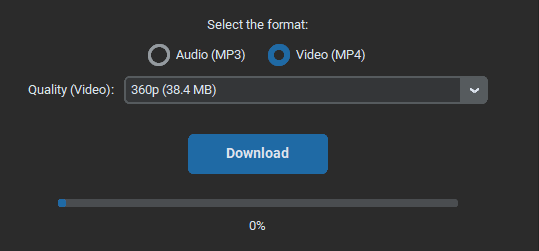

# YouTube Downloader (MP3/MP4) - Pytubefix GUI

[](https://www.python.org/downloads/)
[](https://opensource.org/licenses/MIT)
[](https://github.com/pytubefix/pytubefix)
[](https://github.com/TomSchimansky/CustomTkinter)

 <!-- Replace YourUsername/YourRepoName -->
 <!-- Replace YourUsername/YourRepoName -->

---

**Download your favorite YouTube videos or audios easily and quickly with this intuitive desktop application.**

This application allows you to download YouTube content in MP4 (video) or MP3 (audio) format directly to your computer. It offers two modes of operation: download from a specific URL or batch search and download based on search terms.

Built with Python, `pytubefix` for YouTube interaction, and `CustomTkinter` for a modern and pleasant graphical interface.

## ✨ Key Features

*   **Intuitive Graphical Interface:** Easy to use thanks to `CustomTkinter`.
*   **Single URL Mode:** Paste the URL of a YouTube video to download it.
    *   Automatic URL verification when pasting or typing.
    *   Video quality selection (progressive MP4).
*   **Batch Search Mode:** Paste a list of names or search terms (one per line).
    *   The application will search for each term on YouTube.
    *   It will automatically download the first result found for each term.
*   **Flexible Formats:** Download as MP4 video (with audio) or extract only the audio in MP3 format.
*   **Folder Selector:** Easily choose where to save your downloads.
*   **Progress Bar:** Visualize the download progress in real-time.
*   **Cross-Platform:** Works on Windows, macOS, and Linux (as long as Python and Tkinter are installed).

## 📸 Screenshots

*(Here you can add your screenshots. Replace the descriptive text with the Markdown image syntax)*

**Single URL Mode:**


**Batch Search Mode:**


**Quality Selection (URL Mode):**


## 🛠️ Installation

You need to have **Python 3.8 or higher** installed on your system.

1.  **Clone the repository (or download the ZIP):**
    ```bash
    git clone https://github.com/Nikoxx99/BetterYoutubeDownloader.git # Replace with your URL
    cd BetterYoutubeDownloader
    ```

2.  **(Optional but recommended) Create a virtual environment:**
    ```bash
    python -m venv venv
    # Activate it:
    # Windows: .\venv\Scripts\activate
    # macOS/Linux: source venv/bin/activate
    ```

3.  **Install dependencies:**
    The application requires the following libraries. You can install them using pip:
    ```bash
    pip install pytubefix customtkinter CTkMessagebox
    ```
    *   `pytubefix`: For interacting with the YouTube API.
    *   `customtkinter`: For the modern graphical user interface.
    *   `CTkMessagebox`: For displaying dialog boxes and messages elegantly.

## ▶️ How to Use

1.  **Run the application:**
    ```bash
    python download.py
    ```

2.  **Select the Mode:**
    *   **Single URL:** Paste the full YouTube video URL into the corresponding field. The application will automatically verify the URL and, if it's valid and you selected "Video (MP4)", it will load the available qualities.
    *   **Batch Search:** Paste a list of song names, artists, or any search term into the large text box, ensuring each term is on a new line.

3.  **Choose the Destination Folder:** Click "Select" ("Seleccionar") to choose where the downloaded files will be saved.

4.  **Select the Format:** Choose between "Audio (MP3)" or "Video (MP4)".

5.  **(URL Mode - Video Only):** If you chose "Video (MP4)" and the URL is valid, select the desired quality from the dropdown menu.

6.  **Download:** Click the "Download" ("Descargar") button.
    *   In **URL Mode**, the specified video/audio will be downloaded.
    *   In **Batch Mode**, the application will search for each term and download the first result for each, showing the overall progress and the status of each item.

7.  **Monitor Progress:** Observe the progress bar and status label to see the download progress.

## 🤝 Contributions

Contributions are welcome. If you have ideas to improve the application, find a bug, or want to add new features, please:

1.  Fork the repository.
2.  Create a new branch (`git checkout -b feature/AmazingFeature`).
3.  Make your changes and commit (`git commit -m 'Add some AmazingFeature'`).
4.  Push to the branch (`git push origin feature/AmazingFeature`).
5.  Open a Pull Request.

## 📄 License

This project is under the MIT License. See the `LICENSE` file (if you add one) for more details.

---

*Created with ❤️ using Python*